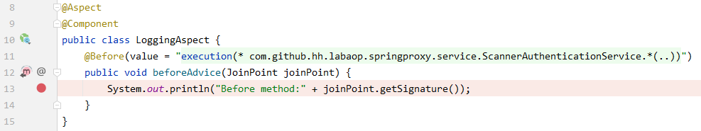

== Excersise 1
. Set a break point as the following picture shows
+


. Run `ScannerAuthenticationServiceTest`
. Inspect the debug view when execution is suspended

 with interface implementation, test prints:
```
Before method:void com.github.hh.labaop.springproxy.service.AuthenticationService.auth()
Authenticate with scanner
class com.sun.proxy.$Proxy55
```
the autowired AuthenticationService is a sibling of ScannerAuthenticationService

== Excersise 2
. Remove interface inheritance in `ScannerAuthenticationService`
. Change the private field type from `AuthenticationService` to  `ScannerAuthenticationService` in `ScannerAuthenticationServiceTest`
. Set a break point as the following picture shows
+


. Run `ScannerAuthenticationServiceTest`
. Inspect the debug view when execution is suspended